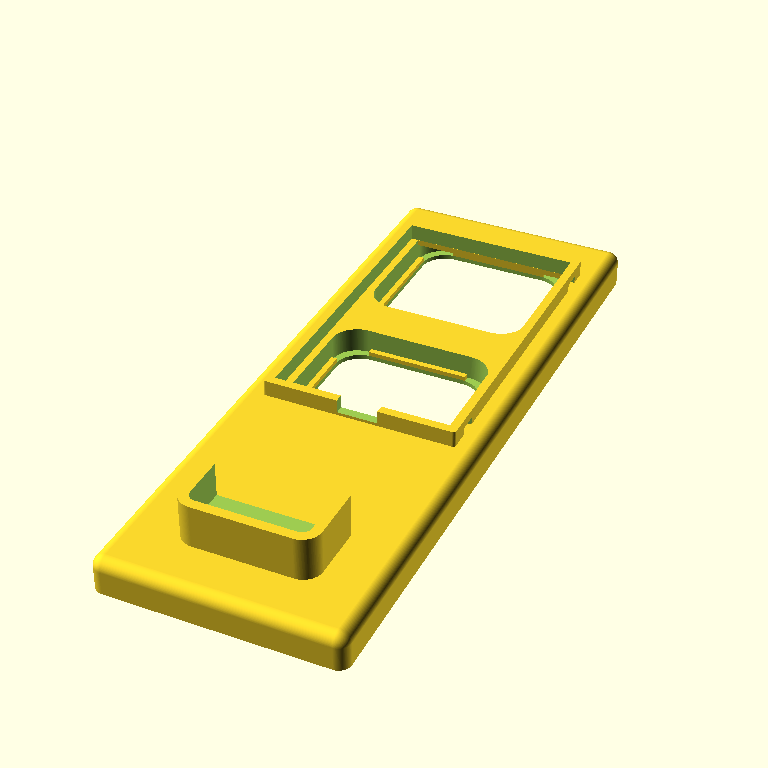
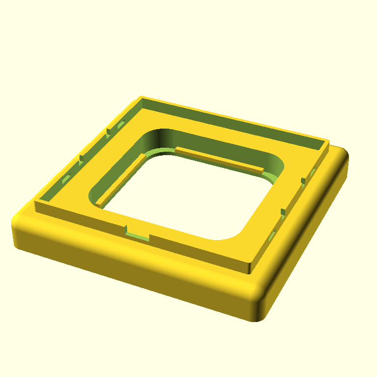

# Huesful-mounts

This repository contains 3d-printable adapter plates to mount the Hue Dimmer switch V1 to Busch-Jäger Reflex Wall Switches.
It is a full OpenSCAD recreation of the models created by Thingiverse User Hoelle: https://www.thingiverse.com/thing:2905340

The reasoning behind this is that the original models were only available as STL and while they are really nice, they don't
cover all possible use-cases, situations, etc.

With this OpenSCAD recreation, it is now possible to customize and adapt these plates to e.g. support the Dimmer Switch V2, 
any other Zigbee Switch, any other Wall Switch series and basically whatever one can come up with

## Autogenerated Overview
| Preview | SCAD | STL |
| --- | --- | --- |
|  | [SCAD File](src/Hue_BuschReflex_1DSv1on0M_N_N_SCREW.scad) | [STL File](stls/Hue_BuschReflex_1DSv1on0M_N_N_SCREW.stl) |
|  | [SCAD File](src/Hue_BuschReflex_1DSv1on1M_N_N.scad) | [STL File](stls/Hue_BuschReflex_1DSv1on1M_N_N.stl) |
|  | [SCAD File](src/Hue_BuschReflex_1DSv1on2M_B-2V_P-1VSD.scad) | [STL File](stls/Hue_BuschReflex_1DSv1on2M_B-2V_P-1VSD.stl) |
|  | [SCAD File](src/Hue_BuschReflex_1DSv1on2M_V_VV_S.scad) | [STL File](stls/Hue_BuschReflex_1DSv1on2M_V_VV_S.stl) |
|  | [SCAD File](src/Hue_BuschReflex_1DSv1on2M_V_VV_SF.scad) | [STL File](stls/Hue_BuschReflex_1DSv1on2M_V_VV_SF.stl) |
|  | [SCAD File](src/Hue_BuschReflex_1DSv1on3M_LYWSD03MMC.scad) | [STL File](stls/Hue_BuschReflex_1DSv1on3M_LYWSD03MMC.stl) |
|  | [SCAD File](src/Hue_BuschReflex_1DSv1on3M_V_VVV.scad) | [STL File](stls/Hue_BuschReflex_1DSv1on3M_V_VVV.stl) |
|  | [SCAD File](src/Hue_BuschReflex_1TDon1M_N_N.scad) | [STL File](stls/Hue_BuschReflex_1TDon1M_N_N.stl) |
|  | [SCAD File](src/Hue_BuschReflex_1TDon2M_N_S.scad) | [STL File](stls/Hue_BuschReflex_1TDon2M_N_S.stl) |
|  | [SCAD File](src/Hue_BuschReflex_2DSv1on1M_VV_N.scad) | [STL File](stls/Hue_BuschReflex_2DSv1on1M_VV_N.stl) |
|  | [SCAD File](src/Hue_BuschReflex_2DSv1on2M_VV_VV_N.scad) | [STL File](stls/Hue_BuschReflex_2DSv1on2M_VV_VV_N.stl) |
|  | [SCAD File](src/Hue_BuschReflex_2DSv1on2M_VV_VV_S.scad) | [STL File](stls/Hue_BuschReflex_2DSv1on2M_VV_VV_S.stl) |
|  | [SCAD File](src/Hue_BuschReflex_2DSv1on3M_VV_VVV.scad) | [STL File](stls/Hue_BuschReflex_2DSv1on3M_VV_VVV.stl) |
|  | [SCAD File](src/Hue_BuschReflex_2DSv1on3M_VV_VVV_S.scad) | [STL File](stls/Hue_BuschReflex_2DSv1on3M_VV_VVV_S.stl) |
